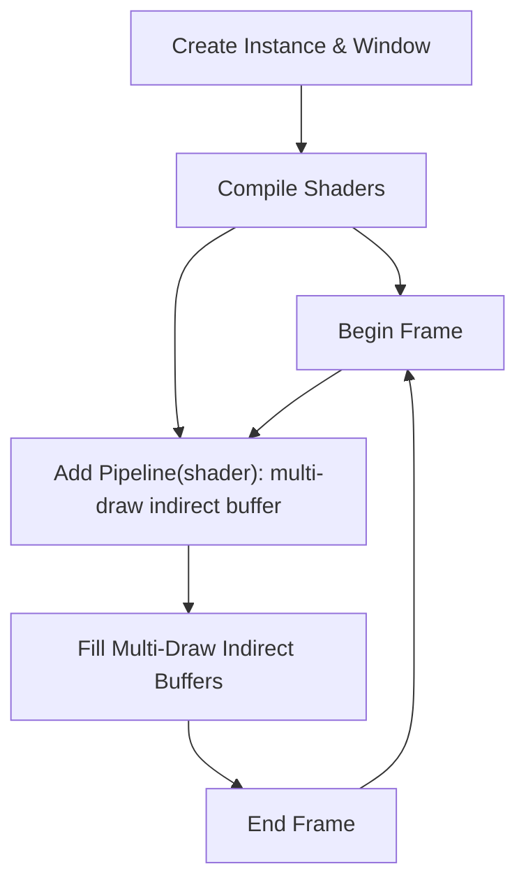

# ez_gfx_api

An experimental Graphics API that aims to be as easy to use as possible while enabling top-tier performance and modern feature set

- Shader declared, render graph, single dispatch approach
- Slang shading language
- Automatically managed render targets declared inside the shader
- Automatically built render graph from shader defined pipelies and render targets
- Bindless texture heap
- Bindless index and vertex buffer heaps. Vertex heaps are automatically bound to shaders by name
- Multi draw indirect only, but easy to use. Adding a pipeline to the render graph gives you a MDI buffer which you fill with draw commands either on the CPU or inside a compute shader

### High level usage flow overview

**Overview:**

1. **Create Instance & Window:** Initialize the graphics API and create an OS window/context.
2. **Compile Shaders:** Use Slang (.slang) shaders, letting the API manage resource bindings and pipeline interfaces.
3. **Begin Frame:** Start a frame or render pass.
4. **Add Pipeline:** Reference compiled shaders, which constructs a pipeline and returns a multi-draw indirect (MDI) buffer for issuing draw commands.
5. **Fill Multi-Draw Indirect Buffers:** Write draw commands and resource bindings to the returned MDI buffers (either on the CPU or within a compute shader).
6. **End Frame:** Finish the frame and present the results.

> See `examples` for a practical example of how shaders declare resources and render targets.
