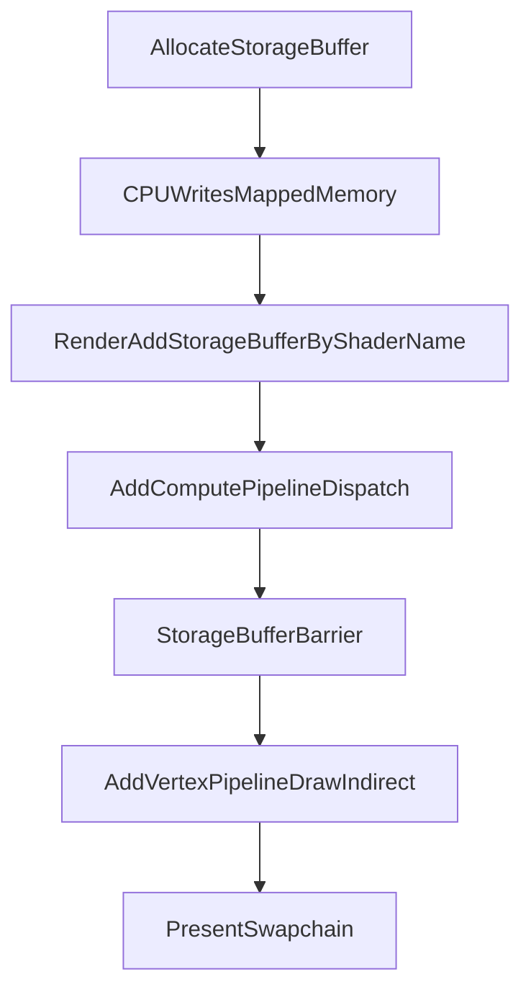

# Compute Shaders And Storage Buffers

## Implementation Shape
- Add a `vendor/glTF2` submodule from `https://github.com/Pawel82S/glTF2` and inspect its API before wiring example 3. If its package shape is incompatible, keep the dependency in place and use the smallest adapter needed in the example.
- Investigate the VMA flags and allocation modes supported by `vendor/odin-vma` before choosing the storage-buffer allocation flags. Storage buffers and indirect buffers should remain separate code paths even when the example uses compute to produce indirect draw data.
- Introduce a storage buffer manager in `src/storage_buffer.odin`, owned by `Ez_Gfx_Ctx` in `src/ctx.odin`:
  - `ez_gfx_allocate_storage_buffer(size: vk.DeviceSize, debug_name: cstring = nil) -> rawptr`
  - `ez_gfx_deallocate_storage_buffer(ptr: rawptr) -> bool`
  - `ez_gfx_render_add_storage_buffer(shader_name: cstring, ptr: rawptr, access: Ez_Gfx_Buffer_Access = .Read_Write) -> bool`
  - Bind storage buffers by the shader-side storage-buffer name; use the returned CPU pointer as the allocation identifier.
  - Track persistently mapped CPU pointers to `VkBuffer` records, debug names, size, live state, last write timeline, and pending destroys.
- Extend shader metadata in `src/shader.odin` and `src/ez_gfx.slang`:
  - Add compute shader kind/entry support while preserving current graphics defaults.
  - Add a storage-buffer attribute such as `[StorageBuffer("mesh_instances", "read_write")]` where the name is the shader-side binding name.
  - Reflect storage buffer name, binding, set, access, and stage mask for graphics and compute.
- Extend pipeline creation in `src/pipeline.odin`:
  - Keep graphics pipeline behavior intact.
  - Add compute pipeline records using `vk.CreateComputePipelines` and `.COMPUTE` bind points.
  - Include reflected storage buffers in descriptor layouts, pools, and descriptor writes.
  - Refresh descriptors when render storage-buffer bindings change, since the CPU pointer can identify a different allocation per render.
- Extend render sessions and graph nodes in `src/render.odin` and `src/render_graph.odin`:
  - Add `ez_gfx_render_add_compute_pipeline(shader, dispatch_x, dispatch_y, dispatch_z, push_constants?)`.
  - Model graph nodes as graphics or compute, with resource accesses for storage-buffer reads/writes in addition to render-target accesses.
  - Insert `vk.BufferMemoryBarrier2` hazards between storage-buffer writes and later reads/writes, including compute-to-graphics and graphics-to-compute ordering.
  - Allow compute nodes without dynamic rendering, while graphics nodes continue to use the current render-target path.
- Update `TODO.md` for any remaining intentional limitations, especially if storage-image support or descriptor ownership refactors remain outside this change.

## Example 3
- Add `examples/3_compute_storage_buffer/` and Justfile recipes `build_example_3`, `example_3`, and `example_3_agent`.
- Use `glTF2` to load a small checked-in glTF asset, upload positions/indices with the existing vertex manager, then allocate storage buffers for:
  - mesh descriptors containing vertex/index offsets and counts,
  - mesh instances,
  - compute input/output metadata needed to populate the indirect draw path.
- Add a compute shader that dispatches once per mesh instance, resolves the mesh descriptor, and writes draw commands.
- Keep indirect draw buffers managed by the indirect-buffer manager; add an explicit bridge/copy/update path if compute-produced command data must become Vulkan indirect-buffer data.
- Add a graphics shader that renders the generated indirect commands with positions and simple per-mesh or per-instance colors. Do not implement materials, textures, animations, or broad glTF feature coverage.

## Tests And Verification
- Add reflection tests for compute entry points, storage-buffer metadata, unsupported descriptor sets, and read vs read-write access.
- Add storage-buffer manager tests for allocation lookup by CPU pointer, deallocation, name binding during render, and stale/missing pointer failures.
- Add render graph tests or validation-backed integration coverage for compute-to-graphics storage-buffer synchronization.
- Run `just test`, `just build_example_1`, `just build_example_2`, and `just build_example_3`. If the environment supports a window/validation run, also run `just example_3_agent`.

