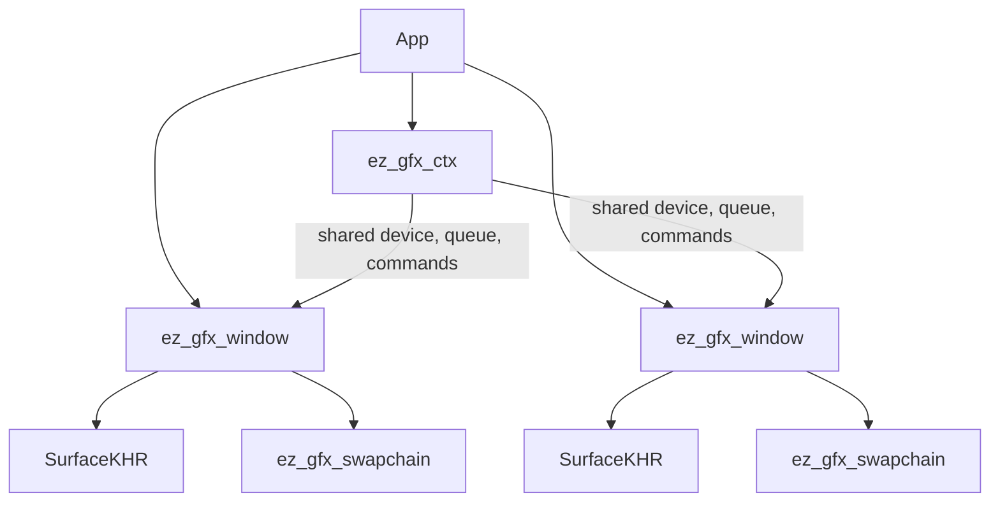

# GFX Architecture Split

## Target Shape

- Keep all files in package `main` under [f:/Projects/oss/ez_gfx_api/src](f:/Projects/oss/ez_gfx_api/src), so `just run` continues to work without changing build configuration.
- Replace the monolithic `App` resource ownership with three modules:
  - `ez_gfx_ctx` in [f:/Projects/oss/ez_gfx_api/src/ez_gfx_ctx.odin](f:/Projects/oss/ez_gfx_api/src/ez_gfx_ctx.odin): owns `instance`, `physical_device`, `device`, `queue_family_index`, `graphics_queue`, `command_pool`, `command_buffer`, `image_available`, and `in_flight`.
  - `ez_gfx_swapchain` in [f:/Projects/oss/ez_gfx_api/src/ez_gfx_swapchain.odin](f:/Projects/oss/ez_gfx_api/src/ez_gfx_swapchain.odin): owns `vk.SwapchainKHR`, format, extent, images, image views, image layouts, and per-image present semaphores.
  - `ez_gfx_window` in [f:/Projects/oss/ez_gfx_api/src/ez_gfx_window.odin](f:/Projects/oss/ez_gfx_api/src/ez_gfx_window.odin): owns the `glfw.WindowHandle`, per-window `vk.SurfaceKHR`, resize flag, and the window's `ez_gfx_swapchain`.
- Keep [f:/Projects/oss/ez_gfx_api/src/main.odin](f:/Projects/oss/ez_gfx_api/src/main.odin) as orchestration and demo rendering only: `App`, `main`, `init_app`, `run`, `draw_frame`, and `record_clear_commands`.

## Ownership Model

This adjusts the original request slightly based on the clarification: `surface` belongs to each window because Vulkan surfaces are per native window, while the context remains the shared instance/device/queue module that can serve multiple windows.

## Refactor Steps

1. Create `ez_gfx_ctx.odin` and move shared Vulkan setup/teardown there:
   - `vulkan_global_proc_loader`, `create_instance`, device selection, logical device creation, command pool/buffer creation, frame sync creation, and context destruction.
   - Change device selection to accept a surface parameter for present-support probing, because the context needs at least one window surface before selecting a present-capable queue.

2. Create `ez_gfx_swapchain.odin` and move swapchain lifecycle there:
   - `Ez_Gfx_Swapchain` struct with current swapchain fields from `App`.
   - `ez_gfx_swapchain_recreate(ctx, surface, width, height)`, `ez_gfx_swapchain_destroy(ctx, swapchain)`, `choose_surface_format`, `choose_extent`, image view creation, and present semaphore creation.
   - Keep acquire/present call sites in `draw_frame` initially to avoid adding a shallow wrapper around Vulkan calls.

3. Create `ez_gfx_window.odin` and move GLFW/window surface ownership there:
   - `Ez_Gfx_Window` with `handle`, `surface`, `framebuffer_resized`, and `swapchain`.
   - Window init/destroy helpers, framebuffer callback, framebuffer-size helper, close/poll helpers, and surface creation from `ctx.instance`.
   - Destroy order: swapchain first, then surface, then window.

4. Update `main.odin` orchestration:
   - `App` becomes a small coordinator, likely `ctx: Ez_Gfx_Ctx` plus a fixed-size windows array or a single `main_window` with room to extend to multiple windows.
   - `init_app` initializes GLFW/window first enough to create a surface, initializes `ctx` using that surface for present queue selection, then creates the window swapchain.
   - `draw_frame` reads through `app.ctx` and `app.main_window.swapchain`, preserving the current clear-frame behavior.
   - Remove the existing TODO about splitting ownership once the split is complete.

5. Verify with the project command:
   - Run `just run` from [f:/Projects/oss/ez_gfx_api](f:/Projects/oss/ez_gfx_api).
   - Fix any compile/runtime issues directly rather than weakening behavior or disabling tests.

## Notes

- I will preserve the current single-window sample behavior while making the data model capable of multiple windows.
- I will keep comments sparse and focused on ownership/lifetime decisions, especially around surface-per-window and Vulkan teardown order.
