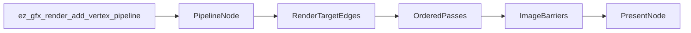

# Render Graph Synchronization Plan

## Domain Decisions

- `Render graph`: a frame-local execution model built during `ez_gfx_begin_render` / `ez_gfx_render_add_vertex_pipeline` / `ez_gfx_finish_render`.
- `Pipeline node`: one vertex pipeline added by the user. Execution preserves add order.
- `Resource edge`: a render target name shared by nodes. A shader target declaration counts as a sampled read edge unless that same node writes the target as an attachment.
- `Present node`: the final virtual node that consumes the swapchain image after the last swapchain-writing pass.
- A pipeline node must not sample a managed target that it also writes as an attachment in the same node. The first implementation should report this as a validation error and cover it with tests.
- The swapchain/default framebuffer is cleared the first time it is used in a frame.
- Managed render targets should preserve previous-frame contents once initialized; read-before-write is valid for accumulation/history effects. Newly created or undefined managed targets still need a one-time clear before they can be read or loaded.

## Implementation Shape

- Add a small render-graph module, likely `[src/render_graph.odin](src/render_graph.odin)`, using fixed-size arrays consistent with the existing renderer style. It will store nodes, per-node resource accesses, and pass boundaries without heap allocation.
- Replace the flat `pipelines` execution path in `[src/render.odin](src/render.odin)` with graph construction during `ez_gfx_render_add_vertex_pipeline` and graph execution during `ez_gfx_finish_render`.
- Preserve the public API: callers still receive `Ez_Gfx_Vertex_Pipeline_Descriptor` and fill MDI buffers the same way.

## Resource And Pass Rules

- During node creation, acquire render targets for all non-swapchain declarations and all non-swapchain attachment usages. This fixes the current offscreen color-target gap in `[src/render_target.odin](src/render_target.odin)`.
- Infer per-node access:
  - `ColorTarget(..., "write"|"read_write")` is a color attachment write.
  - `DepthTarget(..., "write"|"read_write")` is a depth attachment write/read-write and must be wired into dynamic rendering in this change.
  - Any declared target not written by the same node is a sampled read.
  - `swapchain` remains write-only for now, matching current validation in `[src/shader.odin](src/shader.odin)`.
- Validate that a node does not both declare a sampled read and attach-write the same managed target. Attachment feedback loops are out of scope until Vulkan feedback-loop layout/usage semantics are intentionally designed.
- Split dynamic rendering into ordered passes whenever a resource changes role in a way that needs a barrier, especially write-to-sampled-read and write-to-write between different attachment sets.
- Choose attachment `loadOp` from graph state: the swapchain clears on first use; managed targets load when initialized and clear only when their contents are undefined.
- Begin/end `vk.CmdBeginRendering` per pass instead of once per frame, collecting color/depth attachments from only the nodes in that pass.

## Synchronization Work

- Centralize image layout transitions around graph resource state rather than calling `ez_gfx_render_target_manager_transition_shader_targets` once per shader and then attachment transitions later.
- Track current layout/access/stage for each managed target and the current swapchain image, then emit `CmdPipelineBarrier2` between graph passes.
- Preserve managed target layout/content state across frames so read-before-write can consume previous-frame output safely.
- End with an explicit present edge: transition the swapchain image from the last produced layout to `PRESENT_SRC_KHR` before `ez_gfx_render_submit_and_present`.
- Keep the existing single-command-buffer, single-frame-in-flight submit model for this change; timeline semaphores and multiple frames in flight stay as separate TODO work.

## Tests And Examples

- Add reflection/graph unit coverage around declaration-as-read, same-node sample-plus-attachment validation, offscreen color target acquisition, write-to-read ordering, and swapchain-as-present-sink behavior.
- Update or add Slang test shaders under `[tests/shader_reflection/shaders](tests/shader_reflection/shaders)` to cover a two-pass offscreen target flow.
- Run `just test` as the primary test command and `just build` to verify the example still compiles.
- If runtime validation is available locally, run `just run` as a final smoke test.

## Documentation And Follow-Up Notes

- Update `[TODO.md](TODO.md)` by removing or narrowing the completed multi-pass render-target scheduling item and adding any remaining scoped gaps, such as timeline semaphore work or unsupported swapchain reads.
- If the graph terminology stabilizes during implementation, add a small glossary entry to `CONTEXT.md` for `render graph`, `pipeline node`, `resource edge`, and `present node`.
