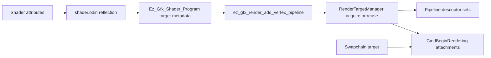

# Render Target Manager Plan

## Architecture

The new module should be deep: shader authors declare render target intent in Slang, while callers keep using the existing render loop (`ez_gfx_begin_render`, `ez_gfx_render_add_vertex_pipeline`, `ez_gfx_finish_render`). The main implementation seam will be a new manager stored on `Ez_Gfx_Ctx`, with the renderer asking it for the targets required by each reflected pipeline.

## Shader Contract

Use output-field attributes for color target usage, function attributes for depth target usage, and variable attributes for target declarations:

- Add `ColorTargetAttribute` on fragment output fields with `(string name, string access)`. The triangle output will use `[ColorTarget("swapchain", "write")] float4 frag_color : COLOR0;`.
- Add `DepthTargetAttribute` on entry-point functions with `(string name, string access)`. The triangle vertex entry will use `[DepthTarget("depth", "read_write")]`.
- Add `RelativeScaleAttribute(float value)` on global texture declarations. The triangle shader will declare a `depth` texture with `[RelativeScale(1.0)]` and `[[vk::binding(1, 0)]]`, leaving CPU example code unaware of the target.
- Add one supporting declaration attribute for layout/format metadata, e.g. `TargetLayout("color", "rgba8")` or equivalent naming, because `RelativeScale` is intentionally only a float and Vulkan allocation needs format/aspect information.

The `swapchain` target is reserved and never allocated by the manager. Any other target name used by `ColorTarget` or `DepthTarget` must have a matching global texture declaration. Multiple `ColorTarget` fields are supported by mapping output field order/location to the Vulkan color attachment list.

## Implementation Steps

1. Add two-pass shader compilation in [`src/shader.odin`](src/shader.odin):
   - Compile a metadata/reflection pass with Slang optimization disabled before the final SPIR-V pass.
   - Reflect target attributes and global target declarations from the unoptimized pass so explicit but otherwise unused target declarations are not optimized away before validation.
   - Keep final shader module generation on the normal optimized path used by rendering.
   - Add a concise comment near the two-pass setup explaining that render targets are part of the engine contract, so reflection must see declarations even when the shader compiler can prove they are unused.

2. Extend shader reflection in [`src/shader.odin`](src/shader.odin):
   - Add fixed-size structs for target usage and target declarations on `Ez_Gfx_Shader_Program`.
   - Reflect `ColorTarget` attributes from fragment output fields and `DepthTarget` attributes through Slang entry-point layouts.
   - Reflect global texture variables for `RelativeScale`, layout/format metadata, descriptor binding, and descriptor set.
   - Validate names, access strings (`read`, `write`, `read_write`), duplicate declarations, and missing declarations.

3. Add [`src/render_target.odin`](src/render_target.odin):
   - Define `Ez_Gfx_Render_Target_Manager`, target declarations, cached texture records, and lightweight texture resources (`vk.Image`, `vk.DeviceMemory`, `vk.ImageView`, optional `vk.Sampler`, extent, format, layout, aspect).
   - Reuse cached targets when name, format/aspect, relative scale, and swapchain extent match.
   - Clear all managed targets on resize and during context destroy. The existing swapchain recreation already waits for device idle, so resize cleanup can be simple and reliable.
   - Keep `swapchain` as a virtual target resolved from `Ez_Gfx_Swapchain`.

4. Wire manager lifetime through [`src/ctx.odin`](src/ctx.odin) and resize paths:
   - Add `render_target_manager` to `Ez_Gfx_Ctx`.
   - Destroy it before `vk.DestroyDevice`.
   - Clear it when [`src/window.odin`](src/window.odin) recreates the swapchain.

5. Move dynamic rendering setup in [`src/render.odin`](src/render.odin):
   - Change `ez_gfx_begin_render` so it starts the command buffer but does not immediately call `vk.CmdBeginRendering` with the swapchain.
   - During `ez_gfx_render_add_vertex_pipeline`, collect the pipeline’s reflected target requirements and acquire non-swapchain targets from the manager.
   - In `ez_gfx_finish_render`, begin dynamic rendering after targets are known, attach color outputs in reflected `ColorTarget` order, transition managed targets according to access, bind pipelines, draw, then transition the swapchain back to present.
   - Keep the first implementation scoped to one core color target (`swapchain`) plus dependency targets, and add TODOs in `TODO.md` for multi-pass ordering if multiple write targets appear later.

6. Expand descriptor creation in [`src/pipeline.odin`](src/pipeline.odin):
   - Generalize the current vertex-heap-only descriptor builder so target textures and samplers can share the descriptor set with existing vertex heap bindings.
   - Use reflected access and texture kind to choose storage image versus sampled image/sampler descriptors.
   - Include target attachment formats in the pipeline cache key where Vulkan dynamic rendering requires them.

7. Add shader reflection tests:
   - Add shader fixtures for valid `swapchain`, managed color, and `depth` declarations.
   - Test multiple `ColorTarget` output fields, missing target declarations, duplicate target declarations, invalid access values, invalid or missing `RelativeScale`, unsupported write access on `swapchain` reads, mismatched depth/color metadata, unsupported descriptor sets, and unused-but-declared targets surviving the unoptimized reflection pass.
   - Add a `just test` recipe so these shader tests run through the project’s configured command surface.

8. Update the triangle example:
   - Edit [`examples/one_triangle/triangle.slang`](examples/one_triangle/triangle.slang) to define and apply `ColorTarget`, `DepthTarget`, `RelativeScale`, and layout metadata.
   - Keep [`examples/one_triangle/main.odin`](examples/one_triangle/main.odin) essentially unchanged except for any compile-time constants or comments needed by the shader contract.

## Verification

Run the configured project commands from the root:

- `just build`
- `just test`
- `just run`

`just test` should cover shader reflection edge cases. `just run` remains the practical render smoke test because it builds, runs for two seconds, and writes `screenshot.png`. If new TODOs remain around multi-target scheduling, add them to [`TODO.md`](TODO.md) rather than leaving them only in chat or code comments.
